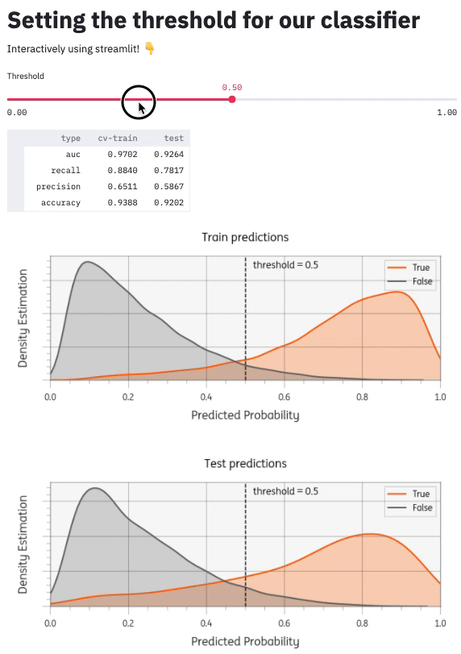

[](https://share.streamlit.io/timvink/demo_streamlit_threshold_classifier/app.py)

# Using streamlit to set the threshold for a classifier

:notebook: This code accompanies the blog post at https://www.timvink.nl/streamlit-threshold-app/

## Intro

Machine learning classifiers can make binary predictions by setting a threshold on the predicted probabilities. Often it makes sense to set this threshold together with business stakeholders that understand the problem domain.

This repository demonstrates a [streamlit](https://docs.streamlit.io/en/stable/index.html) app that can facilitate the interactive setting of threshold.

## App

Run the app with:

```bash
pip install -r requirements.txt
streamlit run app.py
```

This is what it looks like:



## Further reading

Read the full post at [timvink.nl/streamlit-threshold-app/](https://www.timvink.nl/streamlit-threshold-app/)

Other resources:

- [Streamlit video tutorial](https://calmcode.io/streamlit/hello-world.html) Crystal-clear and concise video tutorial by [calmcode.io](https://calmcode.io/)
- [Streamlit 101: An in-depth introduction](https://towardsdatascience.com/streamlit-101-an-in-depth-introduction-fc8aad9492f2) Great example use-case on NYC airbnb data
- [Streamlit API reference](https://docs.streamlit.io/en/stable/api.html#display-text) Overview of all the streamlist elements
- [Streamlit community components](https://www.streamlit.io/components) 
- [awesome-streamlit](https://github.com/MarcSkovMadsen/awesome-streamlit) list of streamlit resources
- [github streamlit topic](https://github.com/topics/streamlit) is a great way to discover more streamlit libraries
